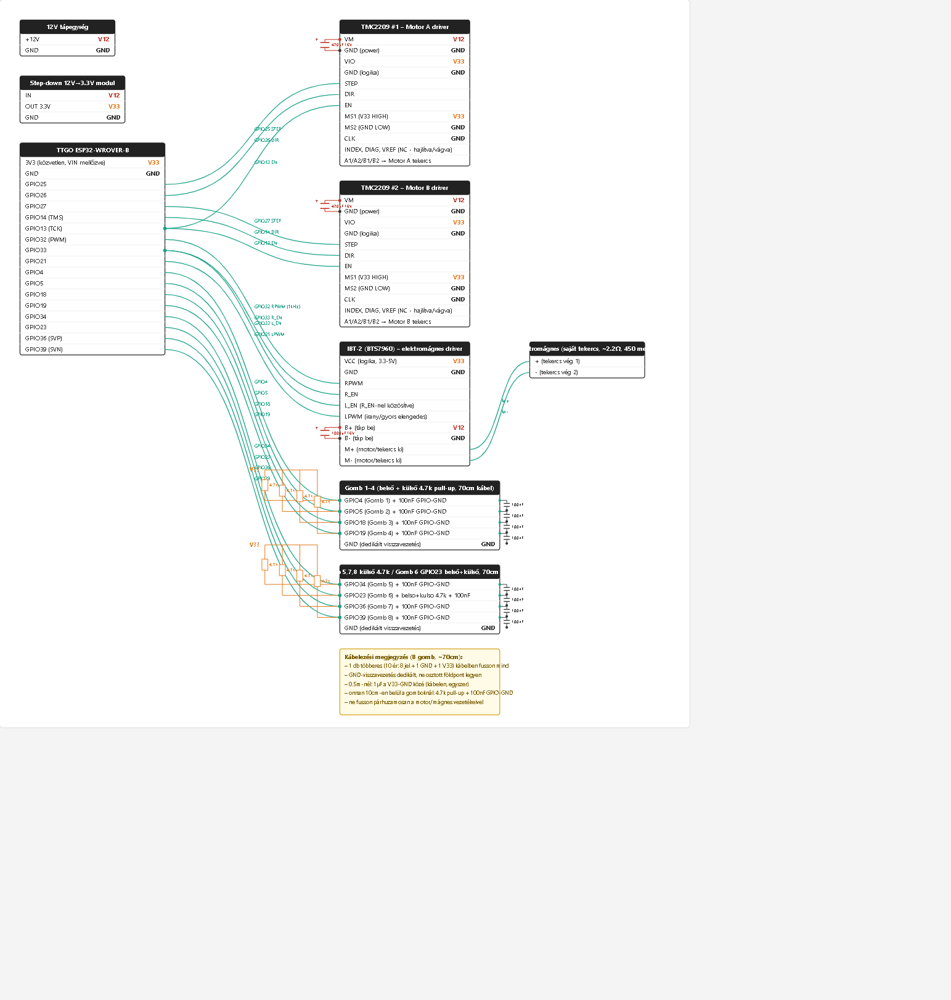

# Wicked Pick and Place - Polargraph

> ESP32-alapú polargraph elven működő **automata ajándékosztó gép**: két léptetőmotor
> tartja és mozgatja egy dyneema damil-párral a kulisszát, mely egy saját tekercselésű
> elektromágnessel leemeli a kiválasztott rekesz ajtaját (kártyáját). 8 gombos
> kódbeviteli felület, böngészős webes UI, és kétféle vezeték nélküli (OTA)
> firmware-frissítés.


## Mi ez?

Egy polargraph-szerű gép (két rögzített pont, két dyneema damil, a köztük lévő
kulissza pozícióját a damilhosszak változtatásával lehet vezérelni), ami
**ajándékokat oszt automata módon**:

- a gép 35 rekeszes polcrendszer előtt mozog; 34 rekeszben van elhelyezve egy-egy
  ajándék, a 35. a kártyák ledobására szolgál
- minden rekesz nyílását egy kártya ("ajtó") takarja; a kulisszán lévő
  elektromágnes ehhez a kártyához megy, beszippantja, majd a ledobónyíláshoz
  "sétál" vele és ott elengedi — eközben a kinyitott rekeszből kivehető az ajándék
- a vezérlést egy 8 gombos panel biztosítja: az ESP32 folyamatosan figyeli a
  gombokat, és a megfelelő kombináció beérkezésekor a hozzá tartozó rekeszt
  nyitja ki; emellett egy beépített webes felület kezeli a konfigurációt és a
  teszt-parancsokat

## Videók

<div align="center">
  <a href="https://youtu.be/3DLXGTaiHjw">
    
    <br>▶ Működés közben
  </a>
  &nbsp;&nbsp;&nbsp;
  <a href="https://youtu.be/2DnzCukh6VA">
    
    <br>▶ Technikai bemutató
  </a>
</div>

## Fő funkciók

- **Inverz/direkt kinematika** a kétdamilos ("két-horgonyos") geometriára, forgó
  kulisszával (a damilok nem a kulissza középpontjában, hanem a kerületén,
  ±45°-ban csatlakoznak — lásd [kinematika_v2.md](kinematika_v2.md))
- **Pick & place szekvenciák**: a 35 rekesz közötti mozgás, állítható utazási és
  "teher alatti" (kártyával terhelt) sebesség, gyorsulás
- **Elektromágnes vezérlés** PWM-es H-híd (IBT-2/BTS7960) meghajtóval, boost
  impulzussal a kártya megbízható felszippantásához
- **8 gombos kezelőfelület**: PLAY mód (4-jegyű kódok alapján rekesz-nyitás) és
  EDIT mód (menürendszer gyors/hosszú koppintásokkal a kalibrációhoz és
  útvonal-szerkesztéshez)
- **FreeRTOS két-magos architektúra**: a mozgásvégrehajtás (Core 0) teljesen
  elkülönül a webszervertől, OTA-tól és gombolvasástól (Core 1) — mozgás közben
  sincs "vak" időszak
- **Webes felület** (ESPAsyncWebServer): állapot, teszt-parancsok, konfiguráció
- **Hangjelzések** (CLICK/ERR/START/DROP) a firmware-be égetve, külön
  fájlfeltöltés nélkül
- **Kétféle OTA frissítés** egymás mellett: PlatformIO hálózati feltöltés
  (ArduinoOTA) és böngészős feltöltés (ElegantOTA)
- **WiFi STA + AP fallback**, mDNS (`wickedpickandplace.local`)

## Hardver

| Komponens          | Eszköz                                   |
| ------------------- | ----------------------------------------- |
| Mikrovezérlő       | ESP32-WROVER-B (TTGO T7 V1.3)             |
| Léptetőmotorok     | 2× léptetőmotor-meghajtó (STEP/DIR), 1.8°/lépés, 1/16 microstepping — tervben A4988, a végleges áramkörben TMC2209 |
| Elektromágnes       | Saját tekercselésű, IBT-2/BTS7960 PWM-meghajtóval, a rekesz-ajtók (kártyák) felszippantására |
| Kezelőfelület       | 8 nyomógomb                               |
| Kommunikáció        | WiFi (STA/AP), webes UI, OTA              |

## Áramköri séma

<div align="center">
  
</div>

Teljes, interaktív verzió: [circuit_schema_v19.html](circuit_schema_v19.html).

## Mechanikai terv (3D / lézervágás)

A kulissza és a gép összes lézerrel vágott lapjának reprodukálható terve egy
Blender (`.blend`) fájlban van: ez tartalmazza a 3D modellt és a belőle generált
vágási rajzokat. A lézervágáshoz szükséges lapokat a **BLECOLAC** Blender-kiegészítővel
generáltuk a 3D modellből.

## Projekt felépítése

```
src/main.cpp        - teljes firmware (kinematika, mozgásvezérlés, gombkezelés, webszerver, OTA)
src/Readme.md       - fejlesztői útmutató: build, WiFi, OTA módok, hibaelhárítás
kinematika_v2.md     - a forgó kulisszás kétdamilos kinematika levezetése
plan_5.md / ppplan_MOVE.md - tervezési jegyzetek a pick-and-place logikához
data/                - firmware-be égetett hangfájlok (click/err/start/drop)
platformio.ini      - PlatformIO projekt- és környezetkonfiguráció
```

## Gyors start

A WiFi hitelesítő adatok nincsenek verziókezelve. Build előtt hozd létre a saját
`include/secrets.h` fájlt a sablon alapján:

```bash
cp include/secrets.example.h include/secrets.h
# majd szerkeszd az include/secrets.h-t a saját SSID/jelszó adataiddal
```

Részletes fejlesztői útmutatóért (szükséges könyvtárak, WiFi-viselkedés, mindkét
OTA-mód lépésről lépésre, hibaelhárítási táblázat) lásd a [src/Readme.md](src/Readme.md) fájlt.

```bash
# Build + USB feltöltés
pio run -e wicked_pickandplace -t upload

# Build + OTA feltöltés (a firmware-nek már futnia kell a gépen)
pio run -e wicked_pickandplace_ota -t upload
```

## Technológiák

[PlatformIO](https://platformio.org/) · [Arduino core for ESP32](https://github.com/espressif/arduino-esp32) ·
[FastAccelStepper](https://github.com/gin66/FastAccelStepper) ·
[ESPAsyncWebServer](https://github.com/ESP32Async/ESPAsyncWebServer) · [ElegantOTA](https://github.com/ayushsharma82/ElegantOTA)
